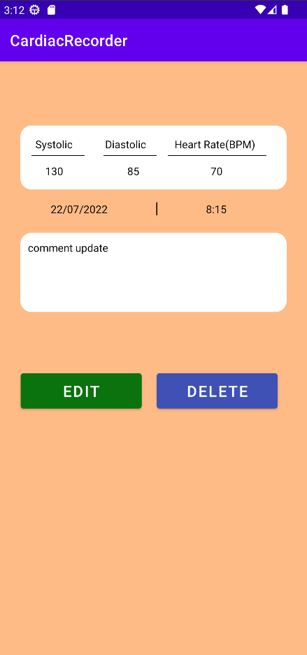
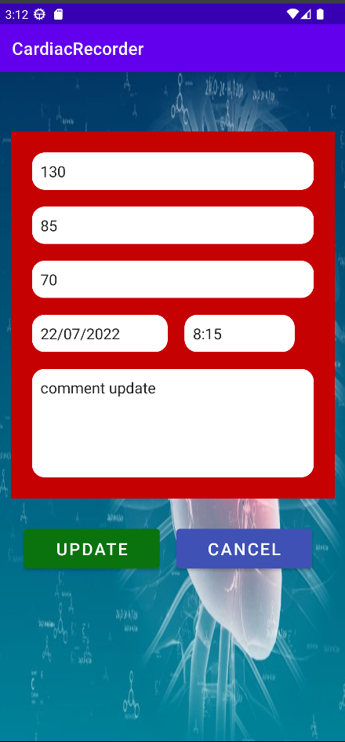

# CardiacRecorder
Cardiac Recorder' is a comprehensive platform designed for tracking and managing data related to blood pressure and heart rate. It allows users to update, delete, and modify their records conveniently. The platform provides a user-friendly interface and robust functionality to ensure efficient data management and analysis.
### <ins> **UI Mockup:** </ins>
 
 

 
 
<table>
 <tr>
   <td></td>
   <td></td>
   <td></td>
 </tr>
</table>  
 
 
<table>
 <tr>
   <td></td>
   <td></td>
    <td></td>
     <td></td>
   
 </tr>
</table> 

### <ins> **UML Diagram:** </ins>
 
 

* More details about this android application project can be found <a href="https://github.com/labib108/CardiacRecorder/wiki">here</a>
